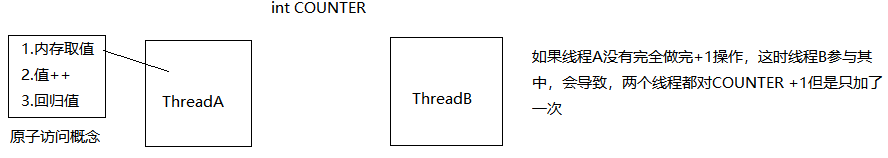

# Linux线程 pthread

## 线程

### 1. 线程是什么

线程是一个调度单位（寄存器和栈），又称轻量级进程(LWP) 

描述进程和线程（进程是最小的资源分配单位，线程是最小的调度单位）

### 2.可以完成的工作和主要用途

线程提供了更轻量的并发方式（提高任务处理速度，缩短任务完成时间）

### 3.注意事项（线程同步）

- 线程共用很多资源

- 进程蜕化为线程
  资源独占是单个进程的主要特性
  如果某一刻该进程与其他调度单位进行了资源共享，那么该进程蜕化为主控线程

- 用户级线程与内核级线程的区别？
  1. 用户级线程按进程分配系统资源
  2. 内核级线程，内核按调度单位分配资源

- 某些单位与概念:

  1. 进程（最小的分配资源单位）
  2. 线程（最小的调度单位）
  3. 纤程（切换速度块）
  4. 协程
  5. 管程（线程同步）
  6. 超线程

## Native POSIX Thread Library (NPTL) 原生线程库 跨平台兼容  -lpthread

1. 线程创建 `pthread_create()`
2. 线程回收 `pthread_join()`
3. 线程退出 `pthread_exit()`
4. 线程分离态`pthread_detach()`
5. 线程取消 `pthread_cancel()`
6. 返回线程 id `pthread_self()`

- 线程基本类型 `pthread_t`（线程id类型）
   `pthread_create(pthread_t *tid, pthread_attr *attr,线程工作指针, void *arg) `

   `pthread_join(pthread_t tid, void * reval）`

进程退出方式

- main中调return用导致进程终止
- 任何位置调用exit()导致进程终止
- 在main函数中遇到末尾范围符进程终止
- 信号终止进程

线程退出方式:

- return方式返回

- `pthread_exit()`结束线程与进程无关

- `pthread_join()`主控线程用于回收普通线程，得到普通线程的返回值

  调用join时需要线程内有**系统调用**，才能正常回收；
  否则，可以调用一次`pthread_testcancel()`

线程创建的数量取决于进程的地址空间大小，32位操作系统用户空间位于0-3G，刨除进程使用的资源大小，除线程栈大小（8M），是线程创建数量

- 线程状态（非分离态/可回收态，分离态）

  如果用户并不关系线程的返回值或者退出码可以将线程置为分离态，分离线程结束后内核回收所有线程资源，当然线程退出值也就扔掉了

  可回收态与分离态互斥（对一个设置了分离的线程进行回收，回收工作出错返回(join)）

  将线程设置分离态: `pthread_detach(pthread_t tid）`

## 线程属性

1. 改变线程优先级（使线程得到更多的资源/时间片）

2. 通过线程属性，更改线程栈地址与栈大小

3. 通过线程属性，更改线程状态

   属性设置线程状态的优点：

   1. 如果需要大批量地将线程设置为分离态，不建议使用pthread_detach，可以通过创建线程属性，遵循该属性批量创建分离态线程

   2. 如果部分线程需要回收，那么通过属性去分离线程不适用，因为分离操作不可逆

   **线程栈大小与地址使用需谨慎！**

   ​	默认的线程属性可以满足绝大部分的线程开发环境，除非极特殊的开发需求，设置线程栈大小存在很大的风险隐患，大大降低线程的稳定性。

   在开发多线程并发程序时，对线程有严格需求时可能修改线程属性，创建线程数量，调高线程优先级。

### 修改线程属性

线程属性类型 `pthread_attr_t`

线程属性初始化`pthread_attr_init()`

线程属性销毁`pthread_attr_destroy()`

设置获取线程属性中的线程状态 `pthread_attr_getdetachstate()` `pthread_attr_setdetachstate()`

设置获取线程属性中的线程栈地址与大小 `pthread_attr_getstacksize()` `pthread_attr_setstacksize()`

## 线程同步 

**并发工作=交替运行**
**并行=每个程序占用一个CPU**

为何同步？

- 多线程合理调度，合理使用资源，避免冲突

- 多线程协同配合，完成任务

- 多线程合理使用资源，保证资源安全完整

例子：两个线程对于全局资源计数器进行操作，每人各加5000次，结果为10000；两个线程同时操作，加快任务完成时间。

若counter是偶数，则线程A工作；若counter为奇数，则线程B工作。

不满足工作条件，则唤醒其他人，并挂起自身

为了解决多线程访问全局资源混乱的问题，加入锁机制

### 1.互斥锁

线程A访问锁，如果锁无人使用，线程A加锁成功，访问临界区。否则线程a阻塞等待。

同一时刻只允许一个线程访问临界区。

#### 互斥锁API

互斥锁类型:`pthread_mutex_t`

互斥锁的初始化
1. 静态初始化 `pthread_mutex_t mutex = PTHREAD_MUTEX_INITIALIZER;`
2. 动态初始化 `int pthread_mutex_init(pthread_mutex_t *restrict mutex,const pthread_mutexattr_t *restrict attr);`

销毁锁 `int pthread_mutex_destroy(pthread_mutex_t *mutex);`
加锁 `int pthread_mutex_lock(pthread_mutex_t *mutex);`
解锁 `int pthread_mutex_unlock(pthread_mutex_t *mutex);`

使用互斥锁的注意事项

一如果临界区中工作量非常大，任务时间过长，直接影响多线程的工作效率。多线程并发效率大大降低。

2.只有对全局资源访问（全局资源读/写）时加锁，保证临界区工作越少越好。

### 2.读写锁

读共享/写独占

读写锁提供多线程对资源访问的全新方式：读写操作互斥，虽然读锁线程有多个但在读时不允许写，写时不允许读。

//

###  3.条件变量

## 死锁产生的必要条件

1. 互斥条件
2. 请求与保持（在使用某资源的情况下还申请新的资源）
3. 循环等待条件（产生环路，每人都在等待相邻人的资源） --一个线程请求多个全局资源
4. 非剥夺条件（某人保有某资源，每人有权限将他的资源强制剥夺）

## 哲学家就餐问题

## 死锁的避免、检测和消除

