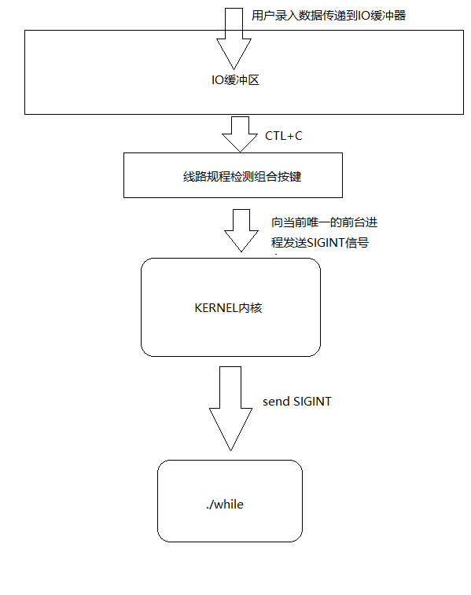
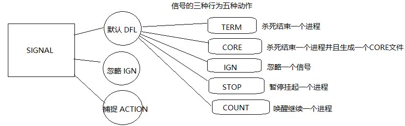
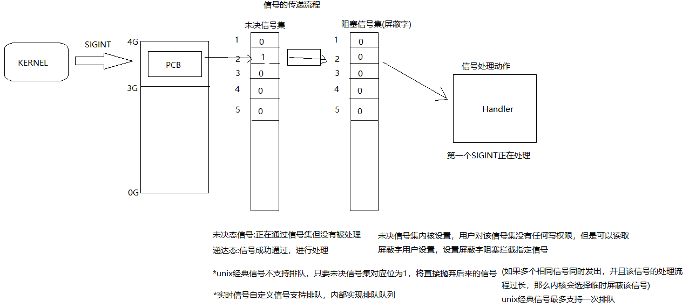
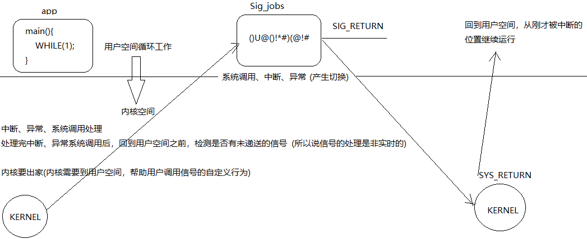
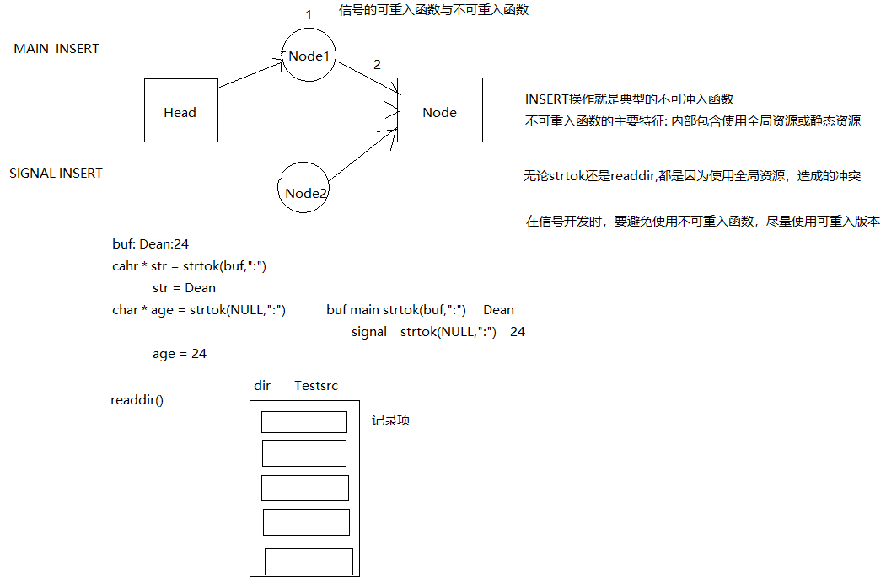

# 信号(Signal)

## 信号

信号，是系统中某种通知或事件

Kill 向某一个进程发送一个信号  *(使用Kill这个名字，是因为绝大多数信号会使进程终止)*

显示系统所支持信号的命令: `kill -l`

前32个称为UNIX经典信号*（软件开发者会使用）*

后32个称为自定义信号（实时信号）*（底层驱动开发者使用）*

### Linux中信号产生的原因与方式

1. 终端按键组合产生

   ctrl-c(2号`SIGINT`) ctrl-\\(3号`SIGQUIT`) ctrl-z(20号`SIGTSTP`)

2. kill命令产生信号

   kill -9 1000 杀死PID1000

   kill -9 -1000杀死PID1000所在组所有进程

3. 硬件异常产生信号

   如 非法操作内存的段错误信号`11) SIGSEGV`

   非法运算 浮点数例外`8) SIGFPE`

4. 函数接口产生信号

   `kill(pid, signo)` 向任意进程发送任意信号

   `raise(signo)` 向调用者发送任意信号

   `abort(void)`向自身发送`6) SIGABRT `

5. 某种软条件产生

   定时器到时，内核向定时进程发送指定信号

   管道无读端，写端写操作，内核发送`SIGPIPE`

   

#### 关于kill函数

`pid > 0`:向指定进程发送信号

`pid == -1`:向当前系统中所有进程发送一个任意信号（仅限有权限的）

`pid < -1`:向指定组发送指定信号（仅限有权限）

### 信号的三种行为 五种动作



使信号失去作用的几种方式： 1. 忽略 2.捕捉 3.阻塞

超级信号（直接为内核服务，不能被任何人阻塞、捕捉、忽略，只要发出必然抵达



## 使用信号处理API

```c
#include <signal.h>  //标准信号头文件
sigset_t; 	//信号集类型
sigemptyset(sigset_t *set); //初始化为0
sigfillset(sigset_t *set);	//初始化为1
sigaddset(sigset_t *set,signo);//某一信号位 置1
sigdelset(sigset_t *set,signo);//某一信号位 置0
sigismember(sigset_t *set,signo);//判断信号位
sigprocmask(int how, sigset_t *nset, sigset_t *oset);//用新的屏蔽字替换原有

```

设置信号集的几种方式

1. `SIG_BLOCK`

2. `SIG_UNBLOCK`

3. `SIG_SETMASK`

| 当前进程屏蔽字 | 新的屏蔽字 | 旧的屏蔽字 |
| -------------- | ---------- | ---------- |
| pset           | nset       | oset       |

`SIG_BLOCK	pset=pset|nset` 

BLOCK通过位或运算设置，新屏蔽字中为1的位，其在就旧屏蔽字对应位变成1。

`SIG_UNLOCK	pset=pset&~nset` 

`SIG_SETMASK	pset=nset` 

## 信号捕捉API

```c
struct sigaction act; //信号行为结构
act.sa_handler=SIG_DEF; SIG_DEL(默认行为) SIG_IGN(忽略行为) 
	void(*sa_handler)(int) （自定义行为·旧  使用时sa_flags=0） 
	void(*sa_sigaction)(int, siginfo_t *, void *)（自定义行为·新  使用时sa_flags=SA_SIGINFO）
act.sa_mask //临时屏蔽字(在某信号执行自定义行为时可选择临时屏幕某些信号)

sigaction(signo, struct *nact, struct *oact); //用新的信号行为，替换进程原有的信号行为
```

捕捉：对信号行为进行更改，从默认行为改为用户自定义行为，捕捉的信号是需要被处理的，只不过处理方式不同

阻塞：对该信号进行屏蔽，拦截防止抵达，但是信号依然存在，只要屏蔽取消，信号依然会结束当前的进程

忽略：对信号进行忽略，该信号顺利从两个信号集通过，而后被丢弃，而不是进入处理流程



### Windows提供的信号API

`signal()`对信号捕捉处理；

`system()`集fork exec wait于一体；

但是他们都不适合与多进程的复杂应用。

## 信号的可重入函数和不可重入函数

