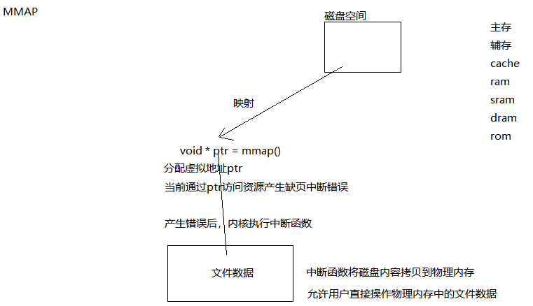

# 进程通信（IPC）

目的：通过进程间通信可以让多进程共享数据，也可以用来控制多进程工作流程。进程通信是在3-4G中进行的

类型：匿名管道PIPE  有名管道FIFO  SYSTEM消息队列  POSIX 消息队列  共享内存段  内存共享映射  信号量  信号  SOCKET

**管道必须具备读写两端才能使用。**

## 匿名管道

流通性  方向性

Pipebuf: 4K (4096Bytes)

管道通过**环形队列**实现。 支持输入输出数据，并且可以暂存。

管道大小:4K （Ubuntu 14.04LTS 64K）

[参考]: https://blog.csdn.net/qq1010234991/article/details/52052542

### 使用管道的几种特殊情况（具有普遍意义）：

1.管道**写端关闭**，**读端**向管道**读**数据，读到0（相当于文件末尾处）

2.管道**读端关闭**，**写端**向管道**写**数据，内核会给写端发送SIGPIPE信号，终止写进程

3.读写端都存在，写端没有写数据，读端产生阻塞

4.读写端都存在，读端没有读数据，写端写满数据后阻塞

### 使用匿名管道的注意事项：

1.使用匿名管道一定要注意通信方向

2.匿名管道为单工工作方式

3.匿名管道中传输的数据为无格式字节流

4.匿名管道只能用于父子进程通信

## 有名管道

作用：完成没有亲缘关系进程的通信(FIFO)

创建一个有名管道的命令：`mkfifo 管道名` 

任意进程只要读写打开该管道，就可以获取管道的使用权

使用管道要有对管道文件的读、写权限，分别在两端打开，否则将会阻塞（*The FIFO must be opened on both ends (reading and writing) before data  can  be  passed.   Normally, opening the FIFO blocks until the other end is opened also.*）

管道文件是内核中管道缓冲区的**映射**，不会存储内容，仅仅是通过管道文件获得内核缓冲区的读写权限。

### 使用有名管道的几种特殊情况：

1.默认情况下，对管道的操作都是阻塞的

2.有写端，写端未向管道写数据，默认读端读会阻塞（若是非阻塞读，会立即返回-1）

#### 对于读操作，阻塞的原因：

对于默认读操作来说，当管道没有数据时 读阻塞

有其他读端正在读，也会读阻塞

注：如果当前进程有多个读操作，阻塞只对第一个读操作生效；如果第一个读操作成功，其他读操作不再阻塞 立即返回。

#### 管道帮助用户保证管道读写时的原子性

写入的数据**小于**管道的大小，**需要**内核保证管道操作的原子性。

写入的数据**大于**管道的大小，**无需**内核保证管道操作的原子性。

## 内存共享映射

内存共享映射是基于文件的进程通信，故也可称为文件共享映射。

使用：`内存首地址 = mmap(NULL,大小,权限,方式,文件,偏移量)`

1. 在NULL附近找一块空闲内存给用户使用
2. 文件大小
3. `PROT_READ|PROT_WRITE`
4. 私有映射`MAP_PRIVATE` 共享映射 `MAP_SHARED`
5. 映射文件的文件描述符
6. 偏移量 只能是4K或4K的整数倍

注：打开(open)文件的权限决定了内存共享映射时的权限

Read读取会产生两次拷贝，第一次从磁盘加载到内核缓冲区，第二次从内核缓冲区拷贝到用户缓冲区。



## 消息队列

两种类型 SYSTEM V  / POSIX

### 常用功能

1.创建消息队列   

- 消息队列随着内核持续，被创建后如果没有用户删除操作，直到关机或重启.    
- SysV的消息队列需要`KEY+关键字`，且每一个`KEY+关键字`只能创建一个队列
- 获取key`key_t  key = ftok(文件名,关键字)`
- 创建`msgid = msgget(key,IPC_CREAT|0644)`

2.写消息队列

`int msgsnd(int msqid, const void *msgp, size_t msgsz, int msgflg);`

```C
struct msgbuf { //自定义的消息结构体
long mtype;       /* message type, must be > 0 */
char mtext[1];    /* message data */
};
```

1. 消息队列ID
2. 消息结构体地址
3. 消息结构体中mtext数组的大小
4. 标志：`IPC_NOWAIT` 当消息队列中空间不足时，非阻塞返回并设置errno为`EAGAIN`

3.读消息队列

`ssize_t msgrcv(int msqid, void *msgp, size_t msgsz, long msgtyp, int msgflg); `

1. 消息队列ID

2. 消息结构体地址

3. 消息结构体中mtext数组的大小

4. 读取的消息类型：

    =0：读取消息队列中任意类型的第一条消息

    \>0：读取指定类型的消息（当MSG_EXCEPT设置的时候为读取第一条非此类型的消息）
    \<0：读取消息队列中第一条类型小于等于其绝对值的消息
    
5. 标志：`IPC_NOWAIT` 当消息队列中无消息时，非阻塞返回并设置errno为`ENOMSG`

4.改消息队列

`int msgctl(int msqid, int cmd, struct msqid_ds *buf);`

1. 消息队列ID

2. 命令

   `IPC_STAT`
   ​	取出系统保存的消息队列的msqid_ds 数据，并将其存入参数buf 指向的msqid_ds 结构
   中。
   `IPC_SET`
   ​	设定消息队列的msqid_ds 数据中的msg_perm 成员。设定的值由buf 指向的msqid_ds
   结构给出。
   `IPC_RMID`
   ​	将队列从系统内核中删除。

3. 消息队列属性结构体指针

5.删消息队列

`msgctl(msqid, IPC_RMID, 0);`

### IPC常用命令

ipcs 用于查看Linux系统中随系统持续的进程间通信方式属性

ipcrm 进行删除操作

参数：

​	-q SYSTEMV消息队列

​	-m 共享内存

​	-s 有名信号量

### POSIX消息队列

//TBA

#### 创建 打开 关闭 删除
#### 读写


